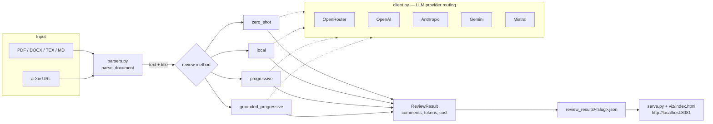
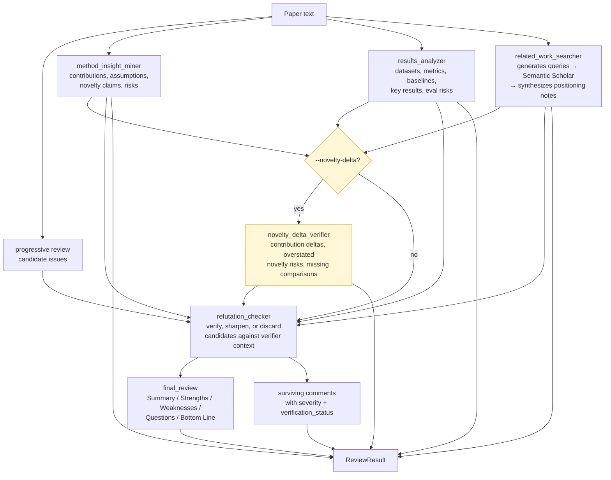

# OpenAIReview

[](https://pypi.org/project/openaireview/)

Our goal is provide thorough and detailed reviews to help researchers conduct the best research. See more examples [here](https://openaireview.github.io/).


## How it works



The pipeline has four stages: **parse** the source into plain text and paragraph indices, **review** with the chosen method (each method calls an LLM via the provider-agnostic [`chat()`](src/reviewer/client.py) wrapper), **persist** the result as viz-compatible JSON, and **serve** the visualization locally. Methods differ in how they chunk the paper and how aggressively they verify candidate issues — see [Review Methods](#review-methods) below and [docs/ARCHITECTURE.md](docs/ARCHITECTURE.md) for module-level details.

## Installation

```bash
uv venv && uv pip install openaireview
# or: pip install openaireview
```

For fast PDF processing (requires `MISTRAL_API_KEY`):
```bash
uv pip install "openaireview[mistral]"
```

For citation hallucination and claim-citation verification via CiteVerify:
```bash
uv pip install -e ".[citation]"
```

For related-work graph enrichment in the visualization:
```bash
uv pip install -e ".[related]"
export S2_API_KEY=...
export CONNECTED_PAPERS_API_KEY=...
# ConnectedPapers_API_KEY is also accepted as an alias.
```

For LangSmith traces around citation hallucination detection:
```bash
uv pip install -e ".[observability]"
export LANGSMITH_TRACING=true
export LANGSMITH_API_KEY=...
```

For development:
```bash
git clone https://github.com/ChicagoHAI/OpenAIReview.git
cd OpenAIReview
uv venv && uv pip install -e .
# or: pip install -e .
```

## Updates

- `--max-pages` and `--max-tokens` to limit input size and save OCR cost
- Mistral OCR and DeepSeek OCR as optional PDF engines (`pip install "openaireview[mistral]"`)
- `openaireview extract` subcommand for two-stage OCR + review workflow
- Multi-provider routing: OpenRouter, OpenAI, Anthropic, Gemini, Mistral (`--provider`)
- Grounded progressive review mode with final review synthesis, verifier outputs, and issue-level evidence metadata
- Optional CiteVerify-backed citation hallucination detection and claim-citation verification (`--method citation_verify` or `--citation-check`)
- Optional novelty-delta verifier for grounded reviews (`--novelty-delta`)
- Related-work visualization enrichment via Semantic Scholar recommendations and Connected Papers (`openaireview[related]`)
- Optional LangSmith tracing for citation hallucination detection (`openaireview[observability]`)
- Table and figure extraction from arXiv HTML (tables as markdown)
- pymupdf4llm + GNN layout as default PDF fallback (replaces raw PyMuPDF)
- Mobile-responsive visualization UI
- Collapsible resolved comments in viz
- Claude Code skill (`/openaireview`) with multi-agent pipeline

### PDF parsing engines (optional)

PDF extraction quality matters — math symbols, tables, and reading order all affect review quality. Four engines are supported, tried in order:

| Engine | Install | Best for | Notes |
|--------|---------|----------|-------|
| **Mistral OCR** | `pip install "openaireview[mistral]"` + set `MISTRAL_API_KEY` | Best overall quality, math, tables | Cloud API, ~$0.001/page |
| **DeepSeek OCR** | `pip install "openaireview[deepseek]"` + local backend | Privacy-sensitive docs | Local model via Ollama/vLLM |
| **Marker** | `uv tool install marker-pdf --with psutil` | Math-heavy PDFs (offline) | Slow without GPU |
| **pymupdf4llm** | (included) | Fallback, always available | No math symbol support |

The engine is auto-detected: if `MISTRAL_API_KEY` is set, Mistral OCR is tried first; then DeepSeek (if installed); then Marker (if on PATH); finally pymupdf4llm. You can force a specific engine with `--ocr`:

```bash
openaireview review paper.pdf --ocr mistral
openaireview review paper.pdf --ocr marker
```

For papers with math, we recommend using `.tex` source, `.md`, or arXiv HTML URLs instead of PDF when possible — these always produce correct output without needing an OCR engine.

## Quick Start

First, set an API key for any supported provider:

```bash
export OPENROUTER_API_KEY=your_key_here   # OpenRouter (supports all models)
# or
export OPENAI_API_KEY=your_key_here       # OpenAI native
# or
export ANTHROPIC_API_KEY=your_key_here    # Anthropic native
# or
export GEMINI_API_KEY=your_key_here       # Google Gemini native
# or
export MISTRAL_API_KEY=your_key_here     # Mistral native (also enables Mistral OCR)
```

Or create a `.env` file in your working directory (see `.env.example`).

Then review a paper and visualize results:

```bash
# Review a local file
openaireview review paper.pdf

# Or review directly from an arXiv URL
openaireview review https://arxiv.org/html/2602.18458v1

# Visualize results
openaireview serve
# Open http://localhost:8081
```

## CLI Reference

### `openaireview review <file_or_url>`

Review an academic paper for technical and logical issues. Accepts a local file path or an arXiv URL.

| Option | Default | Description |
|---|---|---|
| `--method` | `progressive` | Review method: `zero_shot`, `local`, `progressive`, `progressive_full`, `grounded_progressive`, `citation_verify` |
| `--model` | `anthropic/claude-opus-4-6` | Model to use |
| `--provider` | (auto) | LLM provider: `openrouter`, `openai`, `anthropic`, `gemini`, `mistral` |
| `--ocr` | (auto) | PDF OCR engine: `mistral`, `deepseek`, `marker`, `pymupdf` |
| `--max-pages` | (all) | Only process first N pages of a PDF (saves OCR cost) |
| `--max-tokens` | (all) | Truncate input text to first N tokens before review |
| `--novelty-delta` | off | With `--method grounded_progressive`, run an extra novelty/positioning delta verifier |
| `--citation-check` | off | Also run CiteVerify and save citation findings as a separate method block |
| `--citation-model` | `gpt-5.2` | Model for CiteVerify stages |
| `--citation-provider` | `openai` | Provider for CiteVerify stages: `openai`, `anthropic`, `google`, or `gemini` |
| `--citeverify-path` | | Development override for a local CiteVerify checkout |
| `--citation-infer` | off | Use CiteVerify's LLM citation inference for uncited claims |
| `--citation-skip-alignment` | off | Only detect citation hallucinations; skip claim-evidence alignment |
| `--citation-steps-json` | | Optional CiteVerify steps.json path for local citation matching |
| `--citation-try-web-search` | off | Allow CiteVerify's web-search fallback for citation matching |
| `--citation-no-full-text` | off | Use abstracts only for claim-citation alignment |
| `--output-dir` | `./review_results` | Directory for output JSON files |
| `--name` | (from filename) | Paper slug name |

To run citation verification only:

```bash
openaireview review report.md --method citation_verify
```

To add citation checks to a normal review:

```bash
openaireview review paper.md --method grounded_progressive --citation-check --citation-no-full-text
```

### `openaireview extract <file>`

Run OCR extraction only and save as markdown with metadata frontmatter. Useful for a two-stage workflow: extract first, then review the markdown.

| Option | Default | Description |
|---|---|---|
| `-o`, `--output` | `<file>.md` | Output markdown path |
| `--ocr` | (auto) | PDF OCR engine: `mistral`, `deepseek`, `marker`, `pymupdf` |

### `openaireview serve`

Start a local visualization server to browse review results.

| Option | Default | Description |
|---|---|---|
| `--results-dir` | `./review_results` | Directory containing result JSON files |
| `--port` | `8081` | Server port |

## Supported Input Formats

- **PDF** (`.pdf`) — auto-selects best available engine (Mistral OCR > DeepSeek > Marker > pymupdf4llm); see [PDF parsing engines](#pdf-parsing-engines-optional)
- **DOCX** (`.docx`) — via python-docx
- **LaTeX** (`.tex`) — plain text with title extraction from `\title{}`
- **Text/Markdown** (`.txt`, `.md`) — plain text
- **arXiv HTML** — fetch and parse directly from `https://arxiv.org/html/<id>` or `https://arxiv.org/abs/<id>`

## Environment Variables

| Variable | Default | Description |
|---|---|---|
| `OPENROUTER_API_KEY` | | OpenRouter API key (supports all models) |
| `OPENAI_API_KEY` | | OpenAI native API key |
| `ANTHROPIC_API_KEY` | | Anthropic native API key |
| `GEMINI_API_KEY` | | Google Gemini native API key |
| `MISTRAL_API_KEY` | | Mistral API key (also used for Mistral OCR) |
| `MODEL` | `anthropic/claude-opus-4-6` | Default model |
| `REVIEW_PROVIDER` | (auto) | Force a specific LLM provider |

Set one API key. The provider is auto-detected from whichever key is set (priority: OpenRouter > OpenAI > Anthropic > Gemini > Mistral). See `.env.example` for a template.

## Supported Models & Pricing

All models available on [OpenRouter](https://openrouter.ai) are supported — use any model ID via `--model`. The following models have built-in pricing for accurate cost tracking in the visualization:

| Model | Input ($/1M tokens) | Output ($/1M tokens) |
|---|---|---|
| `anthropic/claude-opus-4-6` | $5.00 | $25.00 |
| `anthropic/claude-opus-4-5` | $5.00 | $25.00 |
| `openai/gpt-5.2-pro` | $21.00 | $168.00 |
| `google/gemini-3.1-pro-preview` | $2.00 | $12.00 |

For models not listed above, a default rate of $5.00/$25.00 per 1M tokens is used.

## Review Methods

| Method | What it does | Cost | Best for |
|---|---|---|---|
| `zero_shot` | Single prompt; chunks if > 100K tokens | $ | Quick sanity reviews |
| `local` | Deep-checks each chunk with a sliding window of context | $$ | High recall on long papers |
| `progressive` | Sequential pass with a running summary, then a consolidation step that dedups | $$ | Default — balances recall and precision |
| `progressive_full` | Same as `progressive` but returns pre-consolidation comments | $$ | Debugging or when you want raw output |
| `grounded_progressive` | `progressive` + paper-grounded verifiers (method, results, related work, refutation) and a final synthesized review | $$$ | Papers where evidence-grounding and reviewer-style output matter |
| `citation_verify` | CiteVerify-backed citation hallucination detection plus claim-evidence alignment for cited claims | $$-$$$ | Reports or parsed papers with numeric inline citations and a References section |

Comments from `grounded_progressive` carry extra metadata: `claim`, `evidence`, `rubric_dimension`, `confidence`, `severity`, and `verification_status`. The viz UI surfaces the final review and intermediate verifier outputs as collapsible cards.

### `grounded_progressive` pipeline



For contribution-heavy papers, add `--novelty-delta`. This runs an extra novelty/positioning verifier that separates author novelty claims, closest related work, contribution deltas, overstated novelty risks, and missing-comparison questions. It does not require GROBID, Nougat, MinerU, or related-paper PDF downloads; it reuses OpenAIReview's parsed paper text and related-work summaries. See [docs/FEATURE_PROVENANCE.md](docs/FEATURE_PROVENANCE.md) for notes on which ideas were adapted from ReviewGrounder and the EACL novelty repo.

## Claude Code Skill

A deep-review skill is bundled with the package. It runs a multi-agent pipeline — one sub-agent per paper section plus cross-cutting agents — and produces severity-tiered findings (major / moderate / minor).

Install once:

```bash
pip install openaireview
openaireview install-skill
```

Then in any Claude Code project:

```
/openaireview paper.pdf
/openaireview https://arxiv.org/abs/2602.18458
```

Finally, run `openaireview serve` to see results.

## Development

Install with dev dependencies (includes pytest):

```bash
uv pip install -e ".[dev]"
```

Run tests:

```bash
pytest tests/
```

Integration tests that call the API require `OPENROUTER_API_KEY` and are skipped automatically when it's not set.

## Benchmarks

Benchmark data and experiment scripts are in `benchmarks/`. See `benchmarks/REPORT.md` for results.

## Documentation

- [docs/ARCHITECTURE.md](docs/ARCHITECTURE.md) — module-by-module walkthrough with diagrams
- [docs/FEATURE_PROVENANCE.md](docs/FEATURE_PROVENANCE.md) — what was adopted from ReviewGrounder and the EACL novelty repo, what was changed, what was deliberately left out
- [CONTRIBUTING.md](CONTRIBUTING.md) — contribution guidelines
- [benchmarks/REPORT.md](benchmarks/REPORT.md) — experiment results on the Refine.ink ground-truth set

## Related Resources

- [AI-research-feedback](https://github.com/claesbackman/AI-research-feedback)
- [OpenEvalProject](https://github.com/OpenEvalProject)

## License

[MIT](LICENSE)
