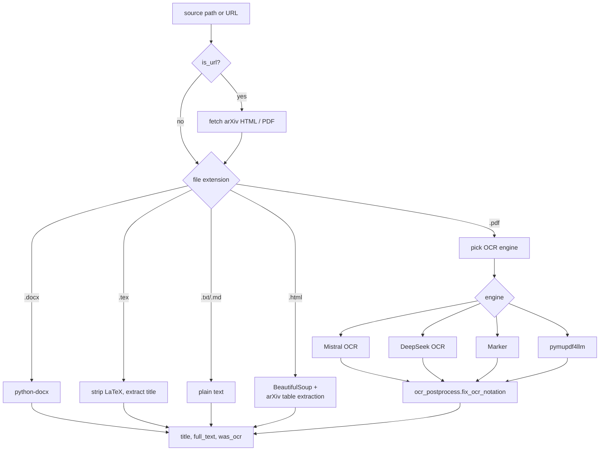
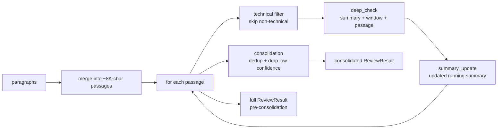

# Architecture

This doc walks through the OpenAIReview codebase module by module, with diagrams for the parts that are easier to understand visually. For a top-level system picture and a `grounded_progressive` pipeline diagram, see the [README](../README.md#how-it-works).

## Module map

```mermaid
flowchart TB
    subgraph cli["CLI (src/reviewer/cli.py)"]
        review[cmd_review]
        extract[cmd_extract]
        serve[cmd_serve]
        perturb[cmd_perturb]
        score[cmd_score]
        install[cmd_install_skill]
    end

    subgraph parsing["Document parsing"]
        parsers[parsers.py<br/>parse_document]
        ocr[ocr_postprocess.py<br/>fix_ocr_notation]
    end

    subgraph methods["Review methods"]
        zs[method_zero_shot.py]
        loc[method_local.py]
        prog[method_progressive.py]
        gr[method_grounded.py]
    end

    subgraph llm["LLM access"]
        client[client.py<br/>chat&#40;&#41;]
        prompts[prompts.py]
    end

    subgraph data["Data + utilities"]
        models[models.py<br/>Comment, ReviewResult]
        utils[utils.py<br/>chunking, parsing, locating]
        evaluate[evaluate.py<br/>cost + recall]
        feedback[feedback_db.py]
    end

    subgraph viz["Visualization"]
        srv[serve.py]
        idx[viz/index.html]
    end

    review --> parsers
    parsers --> ocr
    review --> methods
    methods --> client
    methods --> prompts
    methods --> utils
    methods --> models
    review --> evaluate
    review --> models
    serve --> srv
    srv --> idx
    extract --> parsers
```



## CLI entry points ([src/reviewer/cli.py](../src/reviewer/cli.py))

The CLI exposes six subcommands:

| Subcommand | Function | Purpose |
|---|---|---|
| `review` | [cmd_review](../src/reviewer/cli.py#L41) | Parse + review a document; write viz JSON |
| `extract` | [cmd_extract](../src/reviewer/cli.py#L463) | OCR-only; emit markdown + frontmatter |
| `serve` | [cmd_serve](../src/reviewer/cli.py#L497) | Start the local viz server |
| `perturb` | [cmd_perturb](../src/reviewer/cli.py#L251) | Inject seeded errors into a paper for benchmarking |
| `score` | [cmd_score](../src/reviewer/cli.py#L357) | Score a review against a perturbation manifest |
| `install-skill` | [cmd_install_skill](../src/reviewer/cli.py#L436) | Install the Claude Code `/openaireview` skill |

`cmd_review` is the hot path: it resolves the provider, parses the document, splits it into paragraphs, dispatches to the chosen method, then merges the result into `review_results/<slug>.json` under a `<method>__<model>` key (so multiple runs accumulate in one file for side-by-side viz).

## Document parsing ([src/reviewer/parsers.py](../src/reviewer/parsers.py))

`parse_document(source, ocr=None, max_pages=None)` is the single entry point for any input — local file or arXiv URL — and always returns `(title, full_text, was_ocr)`.



OCR engine selection is auto: try Mistral if `MISTRAL_API_KEY` is set, then DeepSeek, then Marker (if on PATH), then pymupdf4llm as the always-available fallback. `--ocr` forces a specific engine. `was_ocr=True` triggers an OCR caveat injected into review prompts.

## Review methods

All methods write into a [`ReviewResult`](../src/reviewer/models.py) dataclass: `comments: list[Comment]`, token totals, raw responses, optional `final_review` and `verifier_outputs`. Differences:

### `zero_shot` ([method_zero_shot.py](../src/reviewer/method_zero_shot.py))

One prompt over the whole paper. If the paper exceeds 100K tokens, it is chunked and the model is called per chunk; comments are concatenated. Cheapest, lowest recall.

### `local` ([method_local.py](../src/reviewer/method_local.py))

Splits the paper into passages and deep-checks each one with a sliding window of surrounding context. No filtering or consolidation — every candidate makes it into the output. Highest raw recall, lowest precision.

### `progressive` ([method_progressive.py](../src/reviewer/method_progressive.py))



`progressive_full` returns the pre-consolidation `ReviewResult`; `progressive` returns the consolidated one. `cmd_review` saves both when method=`progressive` so you can compare counts in the viz.

### `grounded_progressive` ([method_grounded.py](../src/reviewer/method_grounded.py))

Wraps `progressive` and feeds its output through paper-grounded verifier stages. See the [pipeline diagram in the README](../README.md#grounded_progressive-pipeline). Important details:

- `MAX_PAPER_TOKENS_FOR_VERIFIERS = 40_000`: paper text is truncated for the verifier prompts to keep context manageable.
- `MAX_CANDIDATE_ISSUES = 80`: at most 80 candidate issues are passed to the refutation checker.
- `_search_semantic_scholar` calls the public Semantic Scholar API (uses `S2_API_KEY` if set). Errors are captured per-query and surfaced in `related_work.errors` rather than aborting the run.
- `--novelty-delta` adds the `novelty_delta_verifier` between the related-work search and the refutation checker. The novelty output is fed into both the refutation checker and the final review prompt.

## LLM access ([src/reviewer/client.py](../src/reviewer/client.py))

`chat(messages, model, ...)` is the single LLM call site. Provider resolution is a 4-tier waterfall:

1. `--provider` CLI flag.
2. `REVIEW_PROVIDER` env var.
3. Model-prefix match (`anthropic/claude-*` → Anthropic API if `ANTHROPIC_API_KEY` is set).
4. First available API key, in priority order: OpenRouter > OpenAI > Anthropic > Gemini > Mistral.

Once a provider is picked, the model ID is normalized (e.g. the `anthropic/` prefix is stripped before calling the Anthropic API). All providers expose an OpenAI-compatible chat endpoint, so a single `OpenAI` client object is reused with a different `base_url` and key.

Reasoning-token plumbing is provider-specific:

| Provider | How reasoning is requested |
|---|---|
| OpenRouter | `extra_body.reasoning.max_tokens` |
| Anthropic | `extra_body.thinking.budget_tokens` |
| OpenAI | `reasoning_effort` string ("low" / "medium" / "high") |
| Gemini | `extra_body.thinking.budget_tokens` |
| Mistral | not supported |

If reasoning consumes the entire output budget and the response is empty, `chat()` retries up to 3 times with `max_tokens` doubled each time.

## Data shapes ([src/reviewer/models.py](../src/reviewer/models.py))

`Comment` is the unit a reviewer cares about: `title`, `quote`, `explanation`, `comment_type` ("technical" / "logical"), `paragraph_index`, plus optional grounded-mode fields (`claim`, `evidence`, `rubric_dimension`, `confidence`, `severity`, `verification_status`).

`ReviewResult` accumulates comments + token usage + raw responses + (for grounded mode) `final_review` and `verifier_outputs`. The viz JSON written by `cmd_review` flattens this into:

```jsonc
{
  "slug": "<paper-slug>",
  "title": "...",
  "paragraphs": [{"index": 0, "text": "..."}, ...],
  "methods": {
    "<method>__<model_short>": {
      "label": "...",
      "model": "...",
      "comments": [...],
      "cost_usd": 0.0,
      "prompt_tokens": 0,
      "completion_tokens": 0,
      "final_review": "...",         // grounded only
      "verifier_outputs": {...}      // grounded only
    }
  }
}
```

Multiple runs of the same paper merge into the same JSON file under different `methods[*]` keys.

## Visualization ([src/reviewer/serve.py](../src/reviewer/serve.py), [src/reviewer/viz/index.html](../src/reviewer/viz/index.html))

`openaireview serve` starts a small HTTP server that lists JSON files in `--results-dir` and serves [viz/index.html](../src/reviewer/viz/index.html). The HTML is a single-page app: pick a paper, pick a method, see paragraphs with inline highlighted quotes and a sidebar of comments. Verifier outputs and the final review (if present) render as collapsible cards.

## Benchmark + perturbation tooling

`benchmarks/` holds ground-truth review data plus the perturbation harness used by `cmd_perturb` and `cmd_score`. The flow:

1. `openaireview perturb paper.pdf` injects seeded errors and writes a manifest plus `paper_corrupted.md`.
2. `openaireview review paper_corrupted.md` runs any review method on the corrupted paper.
3. `openaireview score manifest.json review.json` measures recall: did the review surface the injected errors?

This is independent of the main review path — `evaluate.py` covers cost calculation and recall against the original Refine.ink ground truth; the perturbation harness in `benchmarks/` covers seeded-error recall.

## Claude Code skill ([src/reviewer/skill/](../src/reviewer/skill/))

`openaireview install-skill` copies `src/reviewer/skill/` to `~/.claude/commands/openaireview/`. The skill orchestrates a multi-agent pipeline (one sub-agent per paper section + cross-cutting agents) and is independent from the Python review methods — it produces its own viz JSON via `scripts/save_viz_json.py` so the same `openaireview serve` UI works for both.
